<div align="center">
  
</div>

<br>

### `~/journey`



1995: C and assembly inside a chemical plant's process-control system — my first published paper was about it, no kidding. The C never left: it still runs my garage → **[wol-micro](https://github.com/wol-micro)**. Then banks, a university lectern, a 1,200 MW power plant in Nigeria, ML forecasting before it had a hype cycle — SiForeca, an ML forecasting engine and data spider for the National Academy of Sciences of Ukraine — mobile payments and SoftPOS solutions with cryptography for Transplat, Vodafone's TOBi at telecom scale, and a few projects under NDA (can't show them, sorry). Today I design the architecture for a range of fintech projects and for the **HormigasDay** marketplace platform — and instrument AI agents so they respect it → **[architecture-workspace](https://github.com/Lindenson/architecture-workspace)**.

Receipts, not slides: a high-load reactive messenger engine → **[big-messenger](https://github.com/Lindenson/big-messenger)**, and its end-to-end-encrypted client (Signal protocol: X3DH + Double Ratchet) → **[messenger-ui](https://github.com/HormigasMessenger/messenger-ui)**.

### `~/relationships`


<sub>Also on speaking terms with: Kotlin · Python · TypeScript · Scala · C · Kafka · MongoDB · Redis · PostgreSQL · Kubernetes · AWS · Ory · OpenAI · Claude · MCP</sub>

### `~/projects`

<p>
  <a href="https://github.com/Lindenson/big-messenger"></a>
  <a href="https://github.com/Lindenson/architecture-workspace"></a>
</p>
<p>
  <a href="https://github.com/Lindenson/karate-authflow"></a>
  <a href="https://github.com/wol-micro/garageAlarms2.0"></a>
</p>

### `~/deep-dive`

The part I geek out on: **delivery guarantees and end-to-end cryptography.**
[big-messenger](https://github.com/Lindenson/big-messenger) commits every message before it ACKs and never loses it after —
and closed chats stay readable only on the two devices in them. The design essays explain how both promises hold at once:

<p>
  <a href="https://hormigasmessenger.github.io/messenger-design/"></a>
  <a href="https://hormigasmessenger.github.io/messenger-design/encryption.html"></a>
</p>

### `~/rules.yaml`

```yaml
architecture: contract     # prompts are just guidance
ai_agents:    supervised   # ArchUnit + jQAssistant fail the build, not the reviewer
guarantees:   tested       # if the README promises it, an e2e test checks it
performance:  measured     # numbers come from Gatling, not vibes
knowledge:    written_down # ADRs, C4, design notes — for whoever comes next
```

### `~/now`

**Co-founder & architect** @ Hormigas — a high-load marketplace: DDD, events, payments that never double-charge
**Senior software engineer** @ Vodafone — the conversational platform behind TOBi
<sub>previously: iSolutions.IO · NAS of Ukraine · Zuma Energy (Nigeria) · banks · a chemical plant</sub>

### `~/education`

🎓 **Engineer** — Donetsk National Technical University, 1995 · 📈 **PhD in Economics** — NAS of Ukraine, 1998
<sub>…so yes, I can explain why your cloud bill is a game-theory problem.</sub>

<br>

<div align="center">
<sub>

`cd` [wol-micro](https://github.com/wol-micro) — firmware & smart home ·
[wol-juegos](https://github.com/wol-juegos) — games, [▶ play one](https://wol-juegos.github.io/TresEnRaya/) ·
[wol-pruebas](https://github.com/wol-pruebas) — drafts & experiments

</sub>
</div>
